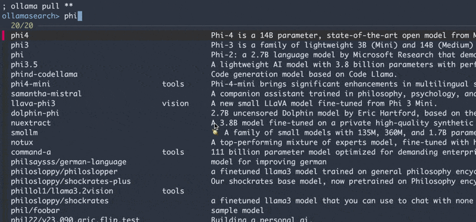

# OllamaSearch

OllamaSearch is a CLI tool for searching models on ollama.com. It is
experimental but nonetheless useful.

## Installation

```
; go install blake.io/ollamasearch@latest
```

## Usage

```
; ollamasearch llama
llama3.3                     tools      New state of the art 70B model. Llama 3.3 70B offers similar performance compare...
llama3.2                     tools      Meta's Llama 3.2 goes small with 1B and 3B models.
llama3.1                     tools      Llama 3.1 is a new state-of-the-art model from Meta available in 8B, 70B and 405...
...
```

Capabilities may be used to filter like:

```
; ollamasearch llama has:vision
gemma3                vision             The current, most capable model that runs on a single GPU.
llava                 vision             🌋 LLaVA is a novel end-to-end trained large multimodal model that combines a ...
llama3.2-vision       vision             Llama 3.2 Vision is a collection of instruction-tuned image reasoning generative...
...
```

## Caveats

This is implemented as a bit of a "hack". It scrapes the HTML from
ollama.com/search to get the model names and descriptions. The ollama.com HTML
is **not an API** and is and will remain unstable for use as one. This may
break at any point. File an issue if it does, and I'll try to fix if I'm still
using this and want it done too, or please submit a PR, and I may merge it.

## FZF

The initial motivation for this was to use it with fzf. To use with fzf
completion, source the fzf.zsh file in your .zshrc.

```
; source /path/to/ollamasearch/fzf.zsh
```

Then you can use it like this:

```
; ollama pull **<tab>
```



## Maybe one day soon:

- [ ] Note models already installed
- [ ] Allow intersection of capabilities (requires changes to ollama.com)
- [ ] Provide JSON or text-based output from /search on ollama.com
